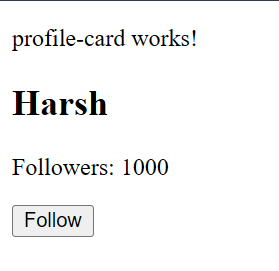

# StudentApp - Day 03 Assignment

This project was generated using [Angular CLI](https://github.com/angular/angular-cli) version 21.2.13.

## Assignment Overview

In this project, we implement a custom component named **"profile-card"** that displays a user's follower count and provides a button to follow the user. The component features an increment method that increases the follower count when the follow button is clicked.

## Implementation Summary

This assignment has been successfully implemented with the following configuration:

### App Component (app.ts)
The main app component imports and uses the ProfileCard component:

```typescript
import { Component, signal } from '@angular/core';
import { ProfileCard } from './profile-card/profile-card';

@Component({
  selector: 'app-root',
  imports: [ProfileCard],
  templateUrl: './app.html',
  styleUrl: './app.css'
})
export class App {
  protected readonly title = signal('student-app');
}
```

### App Template (app.html)
The app template displays the profile-card component:

```html
<app-profile-card></app-profile-card>
```

### ProfileCard Component Logic (profile-card.ts)
The ProfileCard component manages user data and interactions:

```typescript
import { Component, signal } from '@angular/core';

@Component({
  selector: 'app-profile-card',
  imports: [],
  templateUrl: './profile-card.html',
  styleUrl: './profile-card.css',
})
export class ProfileCard {
  name = signal('Harsh');
  followers = signal(1000);
  
  followUser() {
    this.followers.update(count => count + 1);
  }
}
```

**Key Features:**
- Uses Angular signals for reactive state management
- `name`: Signal storing the user's name ('Harsh')
- `followers`: Signal storing the follower count (initial: 1000)
- `followUser()`: Method that increments the follower count by 1 using signal's `update()` method

### ProfileCard Template (profile-card.html)
The template displays user information and provides a follow button:

```html
<h2>{{name()}}</h2>
<p>Followers: {{followers()}}</p>
<button (click)="followUser()">Follow</button>
```

**Template Elements:**
- `<h2>` displays the user's name from the `name` signal (Harsh)
- `<p>` displays the follower count from the `followers` signal (1000)
- `<button>` triggers the `followUser()` method on click to increment followers
- Signal values are accessed using function syntax: `name()` and `followers()`
- Each click increments the follower count by 1

## Running the Application

### Start the development server
```bash
ng serve
```

### View the application
Open your browser and navigate to `http://localhost:4200/`

### Test the functionality
Click the "Follow" button to see the follower count increment in real-time!


### Preview:

